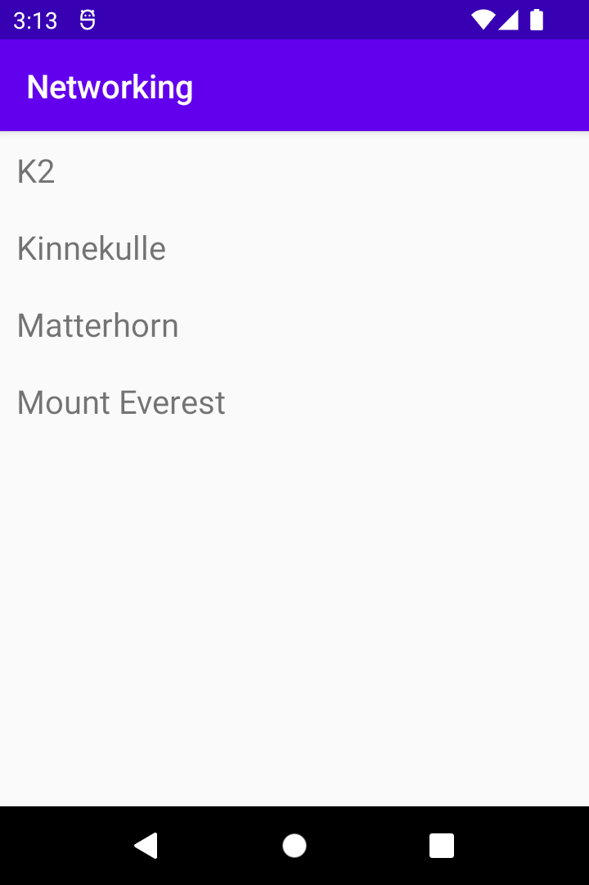

# Rapport

The following is done in this task, the code follows further down.

1. Added RecyclerView to layout.
2. Created a new mountain class.
3. Added `ArrayList<Mountain>` as a member variable in my activity.
4. Created a mountain.xml 
5. Defined the mountain class.
6. Added a recyclerViewAdapter class, and created an instance in onCreate.
7. Enabled internet access.
8. In onPostExecute, I added a solution that unmarshalls the JSON using GSON, and defin
es them as mountains.

```
1.
 <androidx.recyclerview.widget.RecyclerView
        android:id="@+id/recycler_view"
        android:layout_width="match_parent"
        android:layout_height="match_parent"
        app:layout_constraintBottom_toBottomOf="parent"
        app:layout_constraintLeft_toLeftOf="parent"
         app:layout_constraintRight_toRightOf="parent"/>
</androidx.constraintlayout.widget.ConstraintLayout>

2. 

3.
    private ArrayList<Mountain> mountains = new ArrayList<>();

4. 
<?xml version="1.0" encoding="utf-8"?>
<LinearLayout xmlns:android="http://schemas.android.com/apk/res/android"
    android:layout_width="match_parent"
    android:layout_height="wrap_content"
    android:orientation="horizontal"
    android:padding="10dp">

    <TextView
        android:id="@+id/title"
        android:layout_width="wrap_content"
        android:layout_height="wrap_content"
        android:textSize="20sp"/>

</LinearLayout>

5. 
    private String ID;
    private String name;
    @SerializedName("cost")
    private int feet;
    @SerializedName("size")
    private int meter;

    public Mountain(String ID, String name, int feet, int meter) {
        this.ID = ID;
        this.name = name;
        this.feet = feet;
        this.meter = meter;
    }

    public String getID() {
        return ID;
    }

    public String getName() {
        return name;
    }

    public int getFeet() {
        return feet;
    }

    public int getMeter() {
        return meter;
    }

    public void setID(String ID) {
        this.ID = ID;
    }

    public void setName(String name) {
        this.name = name;
    }

    public void setFeet(int feet) {
        this.feet = feet;
    }

    public void setMeter(int meter) {
        this.meter = meter;
    }
    
6. 
       adapter = new RecyclerViewAdapter(this, mountains, new RecyclerViewAdapter.OnClickListener() {
            @Override
            public void onClick(Mountain mountain) {
                Toast.makeText(MainActivity.this, mountain.getName(), Toast.LENGTH_SHORT).show();
            }
        });

        RecyclerView view = findViewById(R.id.recycler_view);
        view.setLayoutManager(new LinearLayoutManager(this));
        view.setAdapter(adapter);

        String url = "https://mobprog.webug.se/json-api?login=brom";
        new JsonTask(this).execute(url);
        
7. 
    <uses-permission android:name="android.permission.INTERNET" />

8.
        Gson gson = new Gson();
        Type type = new TypeToken<ArrayList<Mountain>>() {}.getType();
        ArrayList<Mountain> listOfMountains = gson.fromJson(json, type);
        mountains.addAll(listOfMountains);
        adapter.notifyDataSetChanged();
```



